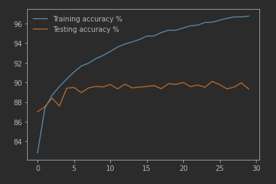

 # Fashion-MNIST-NN
- Using neural networks via PyTorch to classify images of clothes
- Type of the problem: classification problem

## requirements 
- all dependencies exists in [requirements.txt](/requirements.txt) use `pip install -r requirements.txt` to install all requirements

## Contents

### [fashion_MNIST_nn notebook](notebooks/fashion_MNIST_nn.ipynb) 
1. Dataset loading using custom pytorch custom dataset loader
2. view dataset
3. create the NN model
4. training and testing
5. inference and validation

 ## Dataset

- Fashion-MNIST is a dataset of Zalando's article images—consisting of a training set of 60,000 examples and a test set of 10,000 examples. Each example is a 28x28 grayscale image, associated with a label from 10 classes
- dataset exists in [dataset directory](dataset)
  - two CSV files one for training and one for testing.
  - each file has rows of the images where col-1 represent the label of the image and the remaining 784 cols are the image pixels flattened 

### labels
- 0 T-shirt/top
- 1 Trouser
- 2 Pullover
- 3 Dress
- 4 Coat
- 5 Sandal
- 6 Shirt
- 7 Sneaker
- 8 Bag
- 9 Ankle boot

## Model architecture
- the model consists of 4 fully-connected layers
- the first 3 layers use relu activation function and the output layer uses logSoftmax
- loss function used: Cross-entropy loss -> (LogSoftmax + negative log loss)
  - negative log loss (NNloss) takes input LogSoftmax as the model output for all classes and the actual class index
- optimizer used : adam optimizer starting with 0.001 learning-rate

## model accuracy

- best accuracy recorded during training befroe overfitting was at 5th epoch
  - Training Loss: 0.25864401.. Test Loss: 0.28615684.. Train Accuracy: 90.34167% Test Accuracy: 89.41000%
- final model weights exists in [final weights directory](model_weights/final_weights) 

